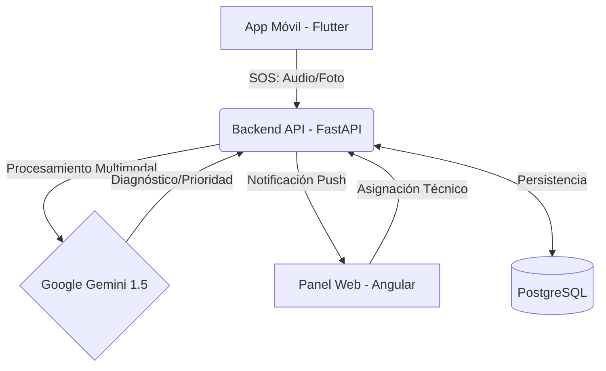

# 🚗 Emergencias Vehiculares AI
### *Plataforma Inteligente de Asistencia en Ruta con IA Multimodal*


---

## 🌟 Visión General
**Emergencias Vehiculares AI** no es solo una aplicación de auxilio mecánico; es un ecosistema digital completo que utiliza **Inteligencia Artificial Multimodal (Google Gemini 1.5)** para transformar la gestión de incidentes viales. 

El sistema permite a los conductores reportar emergencias mediante fotos y audios, los cuales son analizados en tiempo real para determinar el daño, la prioridad y asignar automáticamente al técnico especialista más adecuado del taller más cercano.

---

## 📐 Arquitectura del Sistema

El proyecto está estructurado como un **Monorepo**, garantizando la cohesión entre los servicios:



### Estructura de Carpetas:
*   📂 **`backend/`**: Núcleo del sistema. API REST construida con FastAPI, SQLAlchemy y Alembic.
*   📂 **`frontend-web/`**: Panel administrativo para talleres desarrollado en Angular 18 con un diseño premium dark.
*   📂 **`mobile_app/`**: Aplicación nativa para conductores (Android/iOS) desarrollada en Flutter.
*   📂 **`docs/`**: Documentación técnica, diagramas de secuencia y casos de uso.

---

## 🧠 Inteligencia Artificial y Lógica de Negocio

### Procesamiento de Emergencias
1.  **Análisis Multimodal:** El backend recibe evidencia (imagen del choque + audio del conductor).
2.  **Inferencia Gemini:** La IA identifica el tipo de problema (motor, llantas, eléctrico, choque).
3.  **Match Inteligente:** El sistema filtra los técnicos del taller y calcula un **% de Match** basado en la especialidad del técnico vs. el diagnóstico de la IA.

### Modelo de Monetización
*   **Comisión Automática:** El sistema calcula automáticamente una comisión del **10%** por cada servicio finalizado.
*   **Gestión de Finanzas:** El taller puede visualizar sus ingresos brutos, la comisión de la plataforma y el saldo neto en tiempo real.

---

## 🛠️ Stack Tecnológico

| Componente | Tecnología |
| :--- | :--- |
| **Backend** | Python 3.12, FastAPI, PostgreSQL, JWT, SQLAlchemy. |
| **Frontend Web** | Angular 18, RxJS, TailwindCSS/SCSS, Animate.css. |
| **App Móvil** | Flutter 3.x, Google Maps API, Local Notifications. |
| **IA** | Google Gemini 1.5 Pro/Flash (Google AI Studio). |

---

## 🔗 Acceso al Sistema (Cloud)

*   **🌐 Panel Web:** [https://emergencias-web.onrender.com](https://emergencias-web.onrender.com)
*   **⚙️ Backend API (Swagger):** [https://emergencias-api.onrender.com/docs](https://emergencias-api.onrender.com/docs)

### 🔑 Credenciales de Prueba
| Usuario | Email | Password | Rol |
| :--- | :--- | :--- | :--- |
| **Cliente** | `carlos@example.com` | `password123` | Conductor |
| **Taller** | `elrapido@example.com` | `taller123` | Administrador Taller |

---

## 🚀 Instalación Local

### Backend:
```bash
cd backend
python -m venv venv
source venv/bin/activate  # o venv\Scripts\activate en Windows
pip install -r requirements.txt
uvicorn app.main:app --reload
```

### Frontend Web:
```bash
cd frontend-web
npm install
ng serve
```

### App Móvil:
```bash
cd mobile_app
flutter pub get
flutter run
```

---

## 👨‍💻 Autores
*   **Alejandro Caballero** - *Arquitectura y Desarrollo*
