# Diagramas UML - PUDS
# Plataforma Inteligente de Atención de Emergencias Vehiculares

> **Instrucciones**: Cada diagrama está en formato Mermaid. Puedes:
> 1. Copiar el código y pegarlo en [Mermaid Live Editor](https://mermaid.live) para exportar como PNG/SVG
> 2. Pegarlo directamente en documentos que soporten Mermaid (Notion, GitHub, Confluence)
> 3. Usar en Word/Google Docs: exportar como imagen desde mermaid.live y luego insertar

---

## 1. Diagrama de Casos de Uso - Cliente

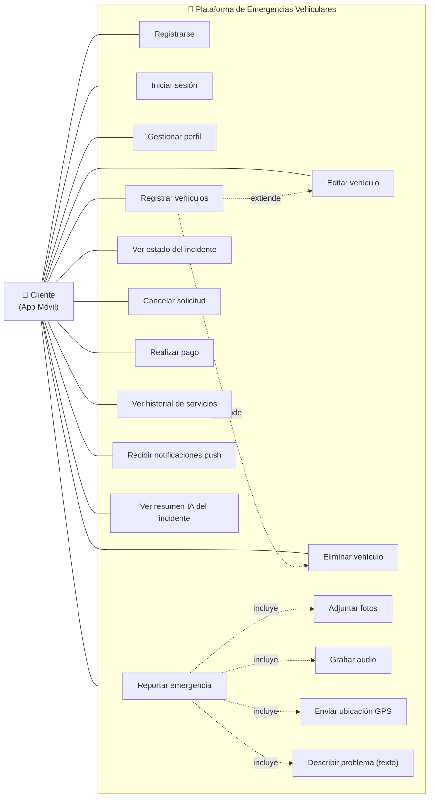

---

## 2. Diagrama de Casos de Uso - Taller

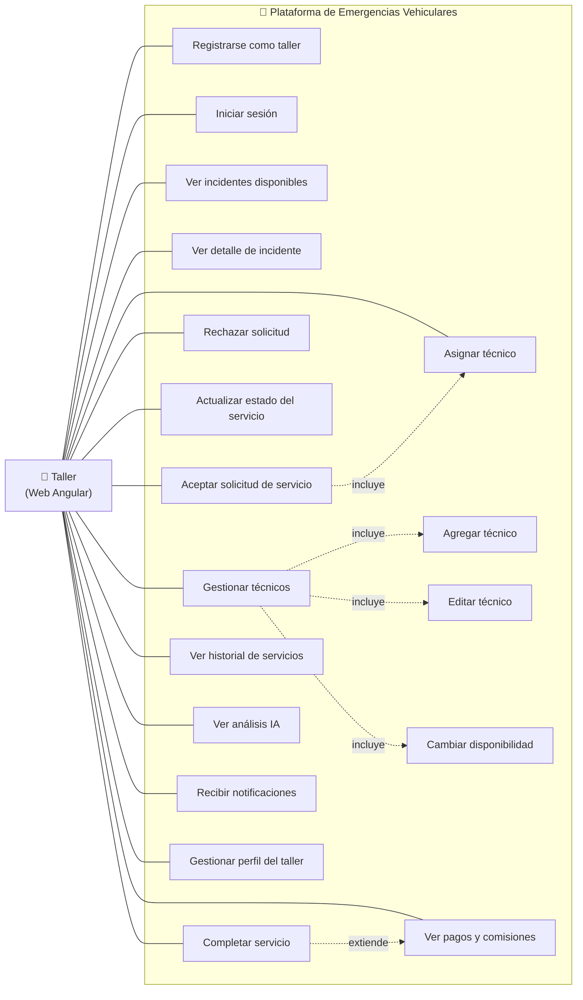

---

## 3. Diagrama de Casos de Uso - Sistema/IA

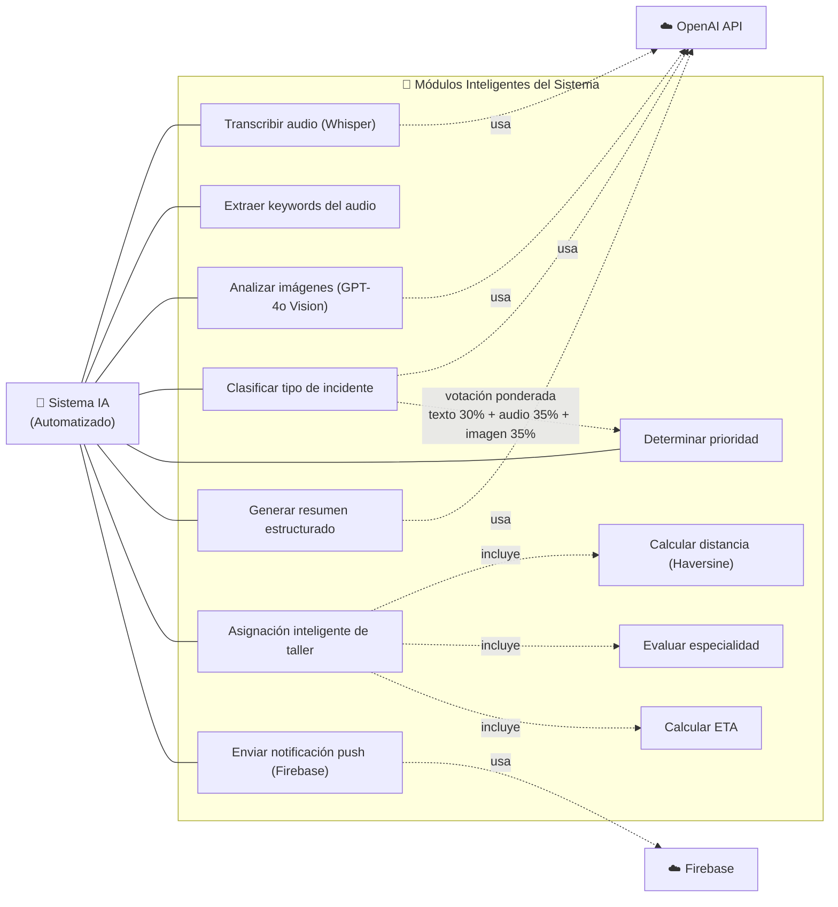

---

## 4. Diagrama de Clases - Modelo de Datos

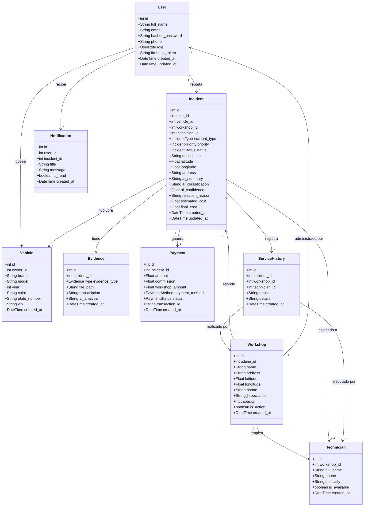

---

## 5. Diagrama de Enumeraciones

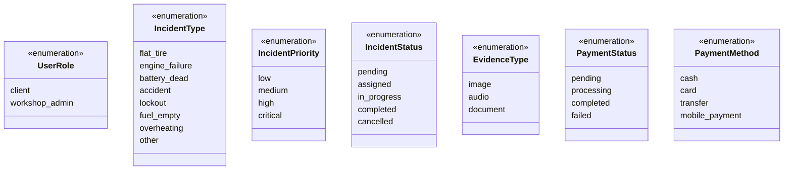

---

## 6. Diagrama de Secuencia - Reporte de Emergencia

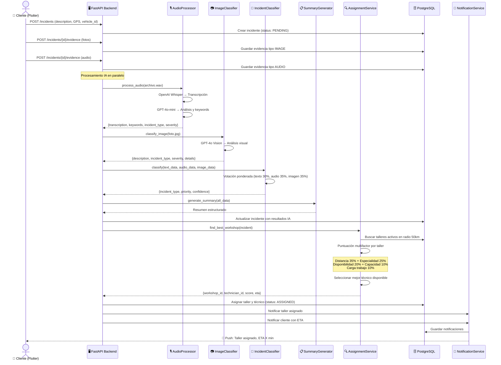

---

## 7. Diagrama de Secuencia - Taller Aceptar/Rechazar/Completar

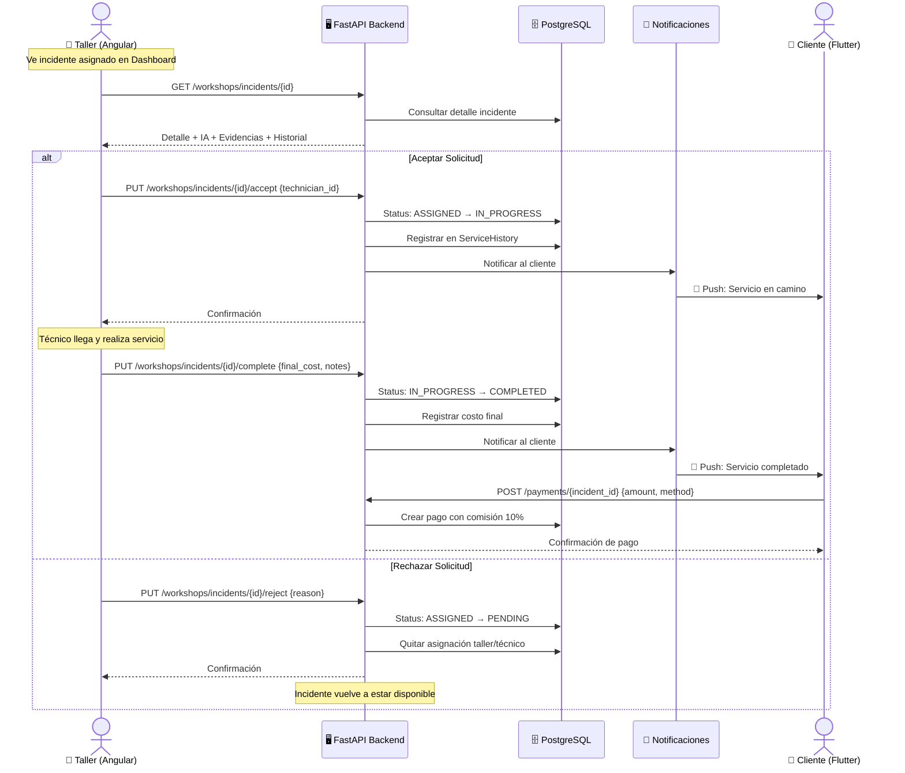

---

## 8. Diagrama de Secuencia - Autenticación JWT

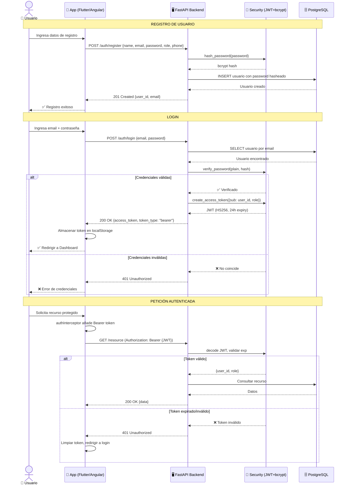

---

## 9. Diagrama de Componentes - Arquitectura del Sistema

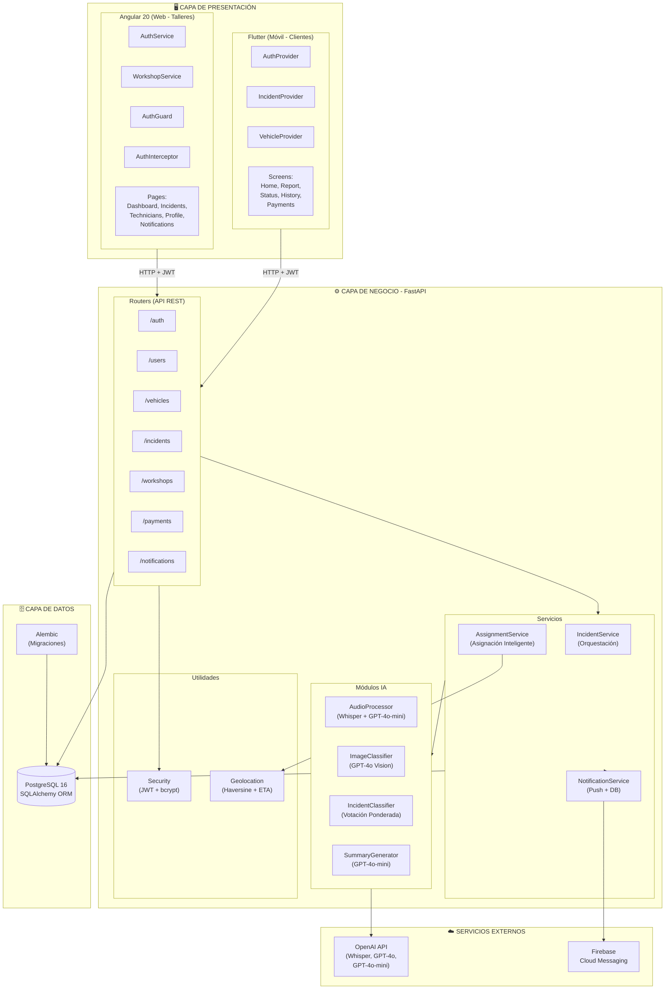

---

## 10. Diagrama de Actividades - Flujo Completo de Emergencia

```mermaid
flowchart TD
    Start([🚗 Cliente detecta emergencia]) --> Login{¿Está autenticado?}
    Login -->|No| DoLogin[Iniciar sesión / Registrarse]
    DoLogin --> Login
    Login -->|Sí| SelectVehicle[Seleccionar vehículo registrado]
    SelectVehicle --> ReportForm[Abrir formulario de reporte]

    ReportForm --> InputText[Escribir descripción del problema]
    ReportForm --> InputPhoto[Tomar fotos del incidente]
    ReportForm --> InputAudio[Grabar audio describiendo situación]
    ReportForm --> InputGPS[Capturar ubicación GPS automática]

    InputText --> Submit[Enviar reporte de emergencia]
    InputPhoto --> Submit
    InputAudio --> Submit
    InputGPS --> Submit

    Submit --> ProcessAI{Procesamiento IA paralelo}

    ProcessAI --> Whisper["🎙️ Whisper: Transcribir audio"]
    ProcessAI --> Vision["📷 GPT-4o Vision: Analizar imágenes"]
    ProcessAI --> TextAnalysis["📝 GPT-4o-mini: Extraer keywords de texto"]

    Whisper --> Classify["🧠 Clasificador: Votación ponderada<br/>Texto 30% + Audio 35% + Imágenes 35%"]
    Vision --> Classify
    TextAnalysis --> Classify

    Classify --> TypeResult["Resultado: Tipo + Prioridad + Confianza"]
    TypeResult --> Summary["📋 Generar resumen estructurado"]
    Summary --> Assignment["🔍 Motor de asignación inteligente"]

    Assignment --> FindWorkshops["Buscar talleres en radio 50km<br/>(Fórmula Haversine)"]
    FindWorkshops --> HasWorkshops{¿Talleres disponibles?}

    HasWorkshops -->|No| NoAssign["⚠️ Sin taller disponible<br/>Status: PENDING"]
    NoAssign --> NotifyClient1["🔔 Notificar: Buscando taller"]

    HasWorkshops -->|Sí| Score["Calcular puntuación multifactor:<br/>Distancia 35% + Especialidad 25%<br/>+ Disponibilidad 20% + Capacidad 10%<br/>+ Carga 10%"]
    Score --> BestMatch["Seleccionar mejor taller + técnico"]
    BestMatch --> Assign["Asignar incidente<br/>Status: ASSIGNED"]
    Assign --> NotifyWorkshop["🔔 Notificar taller asignado"]
    Assign --> NotifyClient2["🔔 Notificar cliente: Taller asignado"]

    NotifyWorkshop --> WorkshopDecision{¿Taller acepta?}
    WorkshopDecision -->|Rechazar| RejectReason["Ingresar motivo de rechazo"]
    RejectReason --> BackToPending["Status: PENDING<br/>Volver a buscar"]
    BackToPending --> Assignment

    WorkshopDecision -->|Aceptar| SelectTech["Seleccionar técnico disponible"]
    SelectTech --> InProgress["Status: IN_PROGRESS<br/>Técnico en camino"]
    InProgress --> NotifyClient3["🔔 Notificar: Técnico en camino + ETA"]

    NotifyClient3 --> ServiceDone["✅ Técnico completa servicio"]
    ServiceDone --> EnterCost["Ingresar costo final + notas"]
    EnterCost --> Complete["Status: COMPLETED"]
    Complete --> NotifyClient4["🔔 Notificar: Servicio completado"]

    NotifyClient4 --> PayDecision{Cliente realiza pago}
    PayDecision --> SelectMethod["Seleccionar método de pago"]
    SelectMethod --> ProcessPay["Procesar pago<br/>(Comisión plataforma 10%)"]
    ProcessPay --> PayConfirm["Pago confirmado ✅"]

    PayConfirm --> EndNode([🏁 Fin del flujo])
    NotifyClient1 --> WaitNode["Esperar asignación manual"]
    WaitNode --> Assignment
```

---

## 11. Diagrama de Despliegue - Arquitectura Física

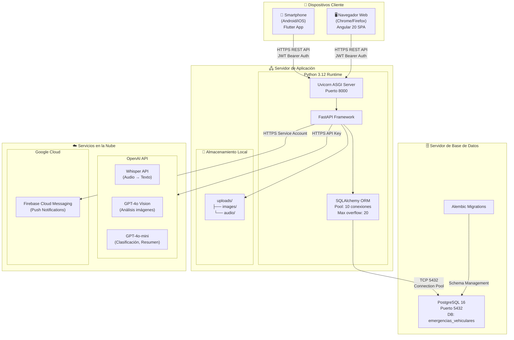
