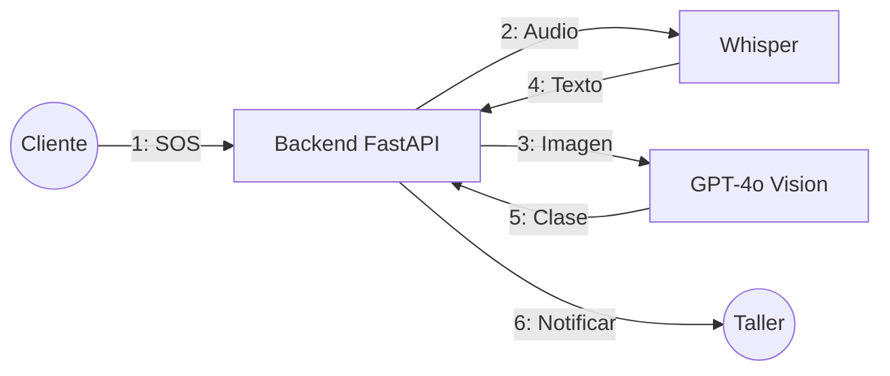

UNIVERSIDAD AUTÓNOMA GABRIEL RENÉ MORENO
FACULTAD DE INGENIERÍA EN CIENCIAS DE LA COMPUTACIÓN Y
TELECOMUNICACIONES
Plataforma Inteligente de Atención de Emergencias Vehiculares
Integrantes:
● Caballero Pereira Alejandro
● Salazar Hurtado Carlos Andres
DOCENTE: Ing. Angélica Garzón Cuellar
Semestre 1/2026
Santa Cruz – Bolivia
1. PERFIL...............................................................................................................................4
1.1. Introducción...............................................................................................................4
1.2. Objetivo General....................................................................................................... 4
1.3. Objetivo Específico....................................................................................................4
1.4. Descripción del problema..........................................................................................5
1.5. Alcance......................................................................................................................6
1.5.1. MÓDULO 1: GESTIÓN DE USUARIOS Y AUTENTICACIÓN.........................6
1.5.2. MÓDULO 2: GESTIÓN DE VEHÍCULOS.........................................................6
1.5.3. MÓDULO 3: REPORTE DE EMERGENCIAS..................................................7
1.5.4. MÓDULO 4: PROCESAMIENTO INTELIGENTE CON IA............................... 7
1.5.5. MÓDULO 5: ASIGNACIÓN INTELIGENTE DE TALLERES............................ 7
1.5.6. MÓDULO 6: GESTIÓN DE TALLERES Y TÉCNICOS.................................... 7
1.5.7. MÓDULO 7: SEGUIMIENTO Y RESOLUCIÓN DE INCIDENTES...................7
1.5.8. MÓDULO 8: PAGOS Y COMISIONES.............................................................8
1.5.9. MÓDULO 9: NOTIFICACIONES EN TIEMPO REAL.......................................8
2. MARCO TEÓRICO.............................................................................................................8
3. FLUJO DE TRABAJO: CAPTURA DE REQUISITOS...................................................... 8
3.1. Identificación del Problema....................................................................................... 8
3.2. Captura de Requisitos...............................................................................................9
3.2.1. Actores y Roles................................................................................................ 9
3.2.2. Casos de uso....................................................................................................9
3.3. Priorizar de casos de uso........................................................................................10
Ciclo #1.....................................................................................................................11
3.4. Detalles del caso de uso......................................................................................... 12
Ciclo #1.....................................................................................................................12
CU1. Registrarse................................................................................................ 12
CU2. Iniciar sesión............................................................................................. 13
CU3. Gestionar perfil.......................................................................................... 14
CU4. Registrar vehículo..................................................................................... 15
CU5. Editar vehículo...........................................................................................16
CU6. Eliminar vehículo....................................................................................... 17
3.5. Prototipo de Interfaz de Usuario..............................................................................18
Ciclo #1.....................................................................................................................18
3.6. Estructurar el Modelo de Caso de Uso................................................................... 18
Ciclo #1.....................................................................................................................18
4. FLUJO DE TRABAJO: ANÁLISIS.................................................................................. 19
4.1. Análisis de arquitectura........................................................................................... 19
4.1.1. Identificar paquetes........................................................................................ 19
4.1.2. Relacionar paquetes y casos de uso............................................................. 20
4.1.3. Vista de paquetes...........................................................................................21
4.2. Diagrama de comunicación.....................................................................................21
Ciclo #1.....................................................................................................................21
4.3. Diagrama de análisis de una clase......................................................................... 21
Ciclo #1.....................................................................................................................21
4.4. Analizar paquete..................................................................................................... 24
5. FLUJO DE TRABAJO: DISEÑO..................................................................................... 25
5.1. Diseño de arquitectura............................................................................................ 25
5.1.1. Diseño físico (Diagrama de despliegue).........................................................25
5.1.2. Diseño Lógico (Diagrama de Paquete).......................................................... 25
5.2. Diagrama de Secuencia.......................................................................................... 25
Ciclo #1.....................................................................................................................25
5.3. Diseño de Datos......................................................................................................32
5.3.1. Diseño de Datos Lógico................................................................................. 32
5.3.1.1. Diagrama de Clase................................................................................32
5.3.1.2. Mapeo....................................................................................................33
5.3.1.3. Normalización........................................................................................33
5.3.2. Diseño de Datos Físico.................................................................................. 34
5.3.2.1. Tabla de Volumen.................................................................................. 34
5.3.2.2. Diagrama Relacional............................................................................. 38
5.3.2.3. Script..................................................................................................... 38
6. FLUJO DE TRABAJO: IMPLEMENTACIÓN.................................................................. 41
6.1. Elección de plataforma de desarrollo de software.................................................. 41
6.2. Implementación de la arquitectura del Sistema...................................................... 42
6.2.1. DIagrama de componente principal del sistema.................................................. 42
8. CONCLUSIÓN................................................................................................................. 42
9. BIBLIOGRAFÍA............................................................................................................... 42
22. ANEXOS........................................................................................................................ 44
7.1 URL completa del Repositorio..................................................................................44
7.2 Acceso al Sistema....................................................................................................44
7.3 Credenciales de Prueba...........................................................................................45
7.5 Código QR de Acceso al Repositorio.......................................................................45
1. PERFIL
1.1. Introducción
La presente documentación describe el desarrollo de la Plataforma Inteligente de Atención
de Emergencias Vehiculares, un sistema multiplataforma que conecta a conductores que
experimentan emergencias mecánicas en carretera con talleres especializados cercanos.
La plataforma emplea inteligencia artificial para el procesamiento multimodal de reportes
(texto, audio e imágenes), la clasificación automática del tipo de incidente y su prioridad,
así como la asignación inteligente del taller más adecuado mediante un algoritmo de
puntuación multifactor. El sistema se compone de una aplicación móvil para clientes
(Flutter), una aplicación web para talleres mecánicos (Angular) y un backend centralizado
con API REST (FastAPI) respaldado por una base de datos PostgreSQL.
1.2. Objetivo General
Desarrollar una plataforma inteligente de atención de emergencias vehiculares que,
mediante el uso de inteligencia artificial y geolocalización, permita a los conductores
reportar incidentes mecánicos de forma rápida y multimodal, y conectarlos
automáticamente con el taller mecánico más adecuado y cercano, reduciendo los tiempos
de respuesta y mejorando la calidad del servicio de asistencia en carretera.
1.3. Objetivo Específico
Implementar un módulo de procesamiento de audio mediante OpenAI Whisper que
transcriba descripciones verbales de emergencias y extraiga información relevante del
incidente.
Desarrollar un módulo de análisis de imágenes con GPT-4o Vision que identifique el tipo
de daño vehicular a partir de fotografías tomadas en el lugar del incidente.
Construir un sistema de clasificación inteligente que, mediante votación ponderada (texto
30%, audio 35%, imágenes 35%), determine automáticamente el tipo de incidente, su
prioridad y nivel de confianza.
Diseñar un motor de asignación inteligente de talleres basado en múltiples factores:
distancia geográfica (35%), especialidad del taller (25%), disponibilidad (20%), capacidad
(10%) y carga de trabajo actual (10%), utilizando la fórmula de Haversine para el cálculo
de distancias.
Desarrollar una aplicación móvil en Flutter que permita a los clientes registrar vehículos,
reportar emergencias con evidencia multimedia (fotos, audio, texto y GPS), realizar
seguimiento en tiempo real y efectuar pagos.
Desarrollar una aplicación web en Angular que permita a los talleres gestionar solicitudes
de servicio, administrar técnicos, aceptar o rechazar incidentes asignados y visualizar el
análisis de inteligencia artificial.
Implementar un sistema de notificaciones push en tiempo real mediante Firebase Cloud
Messaging para mantener informados a clientes y talleres sobre el estado de cada
incidente.
Diseñar e implementar una API REST segura con autenticación JWT y cifrado bcrypt que
centralice toda la lógica de negocio y exponga los servicios necesarios para ambas
aplicaciones cliente
1.4. Descripción del problema
En la actualidad, los conductores que sufren una avería mecánica en carretera enfrentan
múltiples dificultades: desconocen qué talleres se encuentran cerca de su ubicación, no
pueden evaluar la especialidad o disponibilidad de los mecánicos, y carecen de un canal
eficiente para comunicar la naturaleza exacta del problema. Esto genera tiempos de
espera prolongados, asignaciones inadecuadas de talleres que no cuentan con la
especialidad requerida, y una experiencia frustrante tanto para el conductor como para los
prestadores de servicio.
Por otro lado, los talleres mecánicos no disponen de un sistema centralizado que les
notifique sobre emergencias cercanas compatibles con sus especialidades, lo que resulta
en pérdida de oportunidades de negocio y en una distribución ineficiente de la carga de
trabajo entre sus técnicos.
La ausencia de una plataforma que integre geolocalización, inteligencia artificial y
comunicación en tiempo real impide una coordinación efectiva entre conductores en
emergencia y talleres disponibles, generando ineficiencias operativas y riesgos de
seguridad para los conductores varados.
1.5. Alcance
El sistema cubrirá la gestión integral de emergencias vehiculares, conectando a
conductores que sufren averías mecánicas en carretera con talleres especializados
cercanos mediante inteligencia artificial y geolocalización, con posibilidad de ampliación a
otros tipos de asistencia vial (grúas, seguros) en versiones futuras.
Módulos funcionales:
Gestión de usuarios y autenticación.
Gestión de vehículos del cliente.
Reporte de emergencias con entrada multimodal (texto, fotos, audio, GPS).
Procesamiento inteligente con IA (transcripción, análisis de imágenes, clasificación,
resumen).
Asignación inteligente de talleres mediante algoritmo de puntuación multifactor.
Gestión de talleres y técnicos.
Seguimiento y resolución de incidentes.
Pagos y comisiones.
Notificaciones en tiempo real.
Acceso web responsive para talleres (Angular) y aplicación móvil para clientes (Flutter).
1.5.1.MÓDULO 1: GESTIÓN DE USUARIOS Y AUTENTICACIÓN
Objetivo: Permitir el registro, autenticación y control de acceso de los usuarios del sistema
según su rol (cliente o administrador de taller).
Casos de Uso: Registrar usuario, Iniciar sesión, Cerrar sesión, Consultar perfil, Editar
perfil, Validar rol de acceso (cliente / administrador de taller).
1.5.2. MÓDULO 2: GESTIÓN DE VEHÍCULOS
Objetivo: Mantener actualizada la información de los vehículos registrados por cada cliente
para asociarlos a los reportes de emergencia.
Casos de Uso: Registrar vehículo, Editar vehículo, Eliminar vehículo, Consultar lista de
vehículos, Consultar detalle de vehículo.
1.5.3. MÓDULO 3: REPORTE DE EMERGENCIAS
Objetivo: Permitir a los clientes reportar una emergencia vehicular proporcionando
información multimodal (descripción textual, fotografías, grabación de audio y ubicación
GPS automática).
Casos de Uso: Crear reporte de emergencia, Adjuntar fotografías del incidente, Grabar
audio describiendo la situación, Capturar ubicación GPS automática, Seleccionar vehículo
involucrado, Cancelar solicitud de emergencia.
1.5.4.MÓDULO 4: PROCESAMIENTO INTELIGENTE CON IA
Objetivo: Procesar automáticamente la evidencia multimedia del reporte mediante modelos
de inteligencia artificial para clasificar el tipo de incidente, determinar su prioridad y generar
un resumen estructurado.
Casos de Uso: Transcribir audio con OpenAI Whisper, Extraer palabras clave del audio con
GPT-4o-mini, Analizar imágenes con GPT-4o Vision, Clasificar tipo de incidente mediante
votación ponderada (texto 30%, audio 35%, imágenes 35%), Determinar prioridad del
incidente (baja, media, alta, crítica), Generar resumen estructurado con GPT-4o-mini.
1.5.5.MÓDULO 5: ASIGNACIÓN INTELIGENTE DE TALLERES
Objetivo: Seleccionar automáticamente el taller y técnico más adecuado para atender la
emergencia, evaluando múltiples factores y evitando asignaciones ineficientes.
Casos de Uso: Buscar talleres disponibles en radio de 50 km (fórmula de Haversine),
Calcular puntuación multifactor por taller (distancia 35%, especialidad 25%, disponibilidad
20%, capacidad 10%, carga de trabajo 10%), Seleccionar mejor técnico disponible,
Asignar taller y técnico al incidente, Calcular tiempo estimado de llegada (ETA), Reasignar
incidente en caso de rechazo.
1.5.6.MÓDULO 6: GESTIÓN DE TALLERES Y TÉCNICOS
Objetivo: Administrar la información de los talleres mecánicos, sus especialidades,
capacidad operativa y el registro de técnicos con control de disponibilidad.
Casos de Uso: Registrar taller, Editar perfil del taller, Registrar técnico, Editar técnico,
Cambiar disponibilidad de técnico, Consultar lista de técnicos, Consultar especialidades
del taller.
1.5.7. MÓDULO 7: SEGUIMIENTO Y RESOLUCIÓN DE INCIDENTES
Objetivo: Permitir el seguimiento en tiempo real del ciclo de vida del incidente desde su
creación hasta su resolución, tanto para clientes como para talleres.
Casos de Uso: Consultar incidentes disponibles (taller), Consultar incidentes asignados,
Ver detalle del incidente con análisis de IA, Aceptar solicitud de servicio, Rechazar solicitud
de servicio (con motivo), Actualizar estado del incidente (pendiente → asignado → en
progreso → completado), Registrar costo final y notas de cierre, Consultar historial de
servicios.
1.5.8. MÓDULO 8: PAGOS Y COMISIONES
Objetivo: Registrar los pagos realizados por los clientes por el servicio recibido, aplicando
una comisión de plataforma del 10%.
Casos de Uso: Registrar pago del servicio, Seleccionar método de pago (efectivo, tarjeta,
transferencia, pago móvil), Calcular comisión de plataforma (10%), Consultar estado del
pago, Consultar historial de pagos.
1.5.9.MÓDULO 9: NOTIFICACIONES EN TIEMPO REAL
Objetivo: Mantener informados a clientes y talleres sobre cada cambio de estado en los
incidentes mediante notificaciones push y registro en base de datos.
Casos de Uso: Enviar notificación push vía Firebase Cloud Messaging, Notificar asignación
de taller al cliente, Notificarme nueva solicitud al taller, Notificar aceptación/rechazo al
cliente, Notificar finalización del servicio, Consultar lista de notificaciones, Marcar
notificación como leída.
2. MARCO TEÓRICO
3. FLUJO DE TRABAJO: CAPTURA DE REQUISITOS
3.1. Identificación del Problema
El problema central del proyecto consiste en la falta de una solución tecnológica integral
que permita gestionar emergencias vehiculares de manera rápida, organizada, trazable e
inteligente. Los medios tradicionales de asistencia suelen depender de llamadas
telefónicas, contactos informales o búsquedas improvisadas, lo que genera demoras,
incertidumbre y poca claridad en la atención. Del lado del proveedor, los talleres
mecánicos carecen de un mecanismo estructurado para recibir solicitudes, comprender la
naturaleza del problema y asignar recursos con base en ubicación, disponibilidad y tipo de
incidente.
3.2. Captura de Requisitos
3.2.1.Actores y Roles
Actor Rol Función en el sistema
Cliente Usuario solicitante del servicio Utiliza la aplicación móvil para
registrarse, registrar sus vehículos
y reportar emergencias
vehiculares. Puede enviar
ubicación, fotos, audio y texto,
consultar el estado de la solicitud,
visualizar el taller asignado, recibir
notificaciones y realizar el pago
del servicio.
Administrador de Taller Proveedor del servicio de
asistencia
Accede a la aplicación web del
taller para gestionar técnicos,
visualizar solicitudes disponibles,
revisar la información
estructurada del incidente,
aceptar o rechazar solicitudes y
actualizar el estado del servicio.
Técnico Personal operativo del taller Es el responsable de ejecutar la
asistencia directa al cliente.
Atiende la emergencia asignada
según el tipo de percance,
ubicación del cliente y
disponibilidad. Participa en la
resolución operativa del incidente.
Plataforma Inteligente Sistema automatizado de
coordinación y apoyo
Actúa como núcleo del sistema.
Integra datos multimodales,
transcribe audios, analiza
imágenes, clasifica incidentes,
genera resúmenes, asigna
prioridad, selecciona el taller más
adecuado y emite notificaciones
en tiempo real.
3.2.2.Casos de uso
● CU1 Registrarse
● CU2 Iniciar sesión
● CU3 Gestionar perfil
● CU4 Registrar Vehículos
● CU5 Editar Vehículos
● CU6 Eliminar Vehiculos
● CU7 Reportar Emergencia
○ CU7.1 Adjuntar fotos
○ CU7.2 Grabar Audio
○ CU7.3 Enviar ubicacion GPS
○ CU7.4 Describir problema(texto)
● CU8 Ver estado del incidente
● CU9 Cancelar solicitud
● CU10 Realizar pago
● CU11 Ver Historial de servicios
● CU12 Recibir notificaciones push
● CU13 Ver resumen IA del incidente
3.3. Priorizar de casos de uso
ID CASO DE USO ESTADO PRIORIDAD RIESGO ACTOR CICLO
CU1 Registrarse Aprobado Alta Medio Cliente C1
CU2 Iniciar sesión Aprobado Alta Alto Cliente / Taller C1
CU3 Gestionar perfil Aprobado Media Bajo Cliente C1
CU4 Registrar
Vehículos
Aprobado Media Alto Cliente C1
CU5 Editar
Vehículos
Aprobado Media Medio Cliente C1
CU6 Eliminar
Vehiculos
Aprobado Media Medio Cliente C1
CU7 Reportar
Emergencia
Aprobado Alta Medio Cliente C2
CU7.1 Adjuntar fotos Aprobado Media Bajo Cliente C2
CU7.2 Grabar Audio Aprobado Media Bajo Cliente C2
CU7.3 Enviar
ubicacion GPS
Aprobado Media Bajo Cliente C2
CU7.4 Describir
problema(texto)
Aprobado Alta Bajo Cliente C2
CU8 Ver estado del
incidente
Aprobado Alta Bajo Cliente C2
CU9 Cancelar
solicitud
Aprobado Alta Bajo Cliente C2
CU10 Realizar pago Aprobado Alta Baja Cliente C3
CU11 Ver Historial de
servicios
Aprobado Alta Baja Cliente C3
CU12 Recibir
notificaciones
push
Aprobado Alta Baja Cliente / Taller C3
CU13 Ver resumen IA
del incidente
Aprobado Alta Baja Cliente / Taller C3
Ciclo #1
ID CASO DE USO ESTADO PRIORIDAD RIESGO ACTOR CICLO
CU1 Registrarse Aprobado Alta Medio Cliente C1
CU2 Iniciar sesión Aprobado Alta Alto Cliente/Taller C1
CU3 Gestionar perfil Aprobado Media Bajo Cliente C1
CU4 Registrar
Vehiculos
Aprobado Media Alto Cliente C1
CU5 Editar
Vehiculos
Aprobado Media Medio Cliente C1
CU6 Eliminar
Vehiculos
Aprobado Media Medio Cliente C1
3.4. Detalles del caso de uso
Ciclo #1
CU1. Registrarse
CAMPO DESCRIPCIÓN
Nombre del
CU
Registrarse como cliente
Propósito Permitir que una persona cree una cuenta en la plataforma para
acceder a la aplicación móvil y solicitar asistencia vehicular.
Actores que
participan
Cliente
Precondición Ninguna.
Flujo de
trabajo
1. El cliente accede a la opción “Registrarse”. 2. El sistema muestra el
formulario de registro. 3. El cliente ingresa sus datos personales
requeridos, como nombre, correo electrónico, teléfono y contraseña. 4.
El cliente confirma el registro. 5. El sistema valida que los datos estén
completos y sean correctos. 6. El sistema verifica que el correo o
teléfono no estén registrados previamente. 7. El sistema crea la cuenta
del cliente con el rol correspondiente. 8. El sistema muestra un
mensaje de registro exitoso.
PostCondició
n
El cliente queda registrado en la plataforma y puede iniciar sesión.
Excepción Si faltan datos obligatorios, el sistema solicita completarlos. Si el
correo o número de teléfono ya existe, el sistema muestra un mensaje
de duplicidad. Si las contraseñas no cumplen las reglas definidas, el
sistema rechaza el registro. Si ocurre un error interno, la cuenta no se
crea.
CU2. Iniciar sesión
CAMPO DESCRIPCIÓN
Nombre del
CU
Iniciar sesión
Propósito Permitir que el cliente autenticado acceda a la aplicación para
gestionar su perfil, vehículos, emergencias, pagos y notificaciones.
Actores que
participan
Cliente
Precondición El cliente debe estar registrado en la plataforma y tener una cuenta
activa.
Flujo de
trabajo
1. El cliente accede a la pantalla de inicio de sesión. 2. El sistema
muestra el formulario de acceso. 3. El cliente ingresa su correo
electrónico y contraseña. 4. El cliente confirma el inicio de sesión. 5. El
sistema valida las credenciales ingresadas. 6. El sistema verifica que
la cuenta exista y esté activa. 7. El sistema autentica al cliente y
genera su sesión o token de acceso. 8. El sistema redirige al cliente a
la pantalla principal de la aplicación.
PostCondición El cliente queda autenticado y puede acceder a las funcionalidades
permitidas según su rol.
Excepción Si el correo o la contraseña son incorrectos, el sistema muestra un
mensaje de error. Si la cuenta está inactiva o bloqueada, el sistema
impide el acceso. Si ocurre un error del sistema, no se inicia la sesión.
CU3. Gestionar perfil
CAMPO DESCRIPCIÓN
Nombre del
CU
Gestionar perfil del cliente
Propósito Permitir que el cliente consulte y actualice su información personal
dentro de la plataforma.
Actores que
participan
Cliente
Precondición El cliente debe haber iniciado sesión.
Flujo de
trabajo
1. El cliente accede a la opción “Mi perfil”. 2. El sistema muestra la
información actual del perfil. 3. El cliente revisa sus datos registrados.
4. El cliente selecciona la opción “Editar perfil”. 5. El sistema habilita
los campos editables. 6. El cliente modifica los datos permitidos, como
nombre, teléfono o correo electrónico. 7. El cliente guarda los cambios.
8. El sistema valida la información ingresada. 9. El sistema actualiza
los datos del perfil. 10. El sistema muestra un mensaje de
actualización exitosa.
PostCondició
n
El perfil del cliente queda actualizado y disponible para futuras
operaciones en el sistema.
Excepción Si el cliente no ha iniciado sesión, el sistema no permite acceder al
perfil. Si el nuevo correo o teléfono ya pertenece a otra cuenta, el
sistema muestra un mensaje de duplicidad. Si algún dato es inválido o
incompleto, el sistema solicita corregirlo. Si ocurre un error del
sistema, los cambios no se guardan.
CU4. Registrar vehículo
CAMPO DESCRIPCIÓN
Nombre del
CU
Registrar vehículo
Propósito Permitir que el cliente registre un vehículo en la plataforma para
asociarlo posteriormente a reportes de emergencia.
Actores que
participan
Cliente
Precondición El cliente debe haber iniciado sesión.
Flujo de
trabajo
1. El cliente accede a la opción “Mis vehículos”. 2. El sistema muestra
la lista de vehículos registrados y la opción “Agregar vehículo”. 3. El
cliente selecciona “Agregar vehículo”. 4. El sistema muestra el
formulario de registro vehicular. 5. El cliente ingresa los datos
requeridos, como marca, modelo, año, color, placa y VIN. 6. El cliente
confirma el registro. 7. El sistema valida que los datos estén completos
y correctos. 8. El sistema verifica que la placa o VIN no estén
duplicados. 9. El sistema guarda el vehículo en la cuenta del cliente.
10. El sistema muestra un mensaje de registro exitoso.
PostCondició
n
El vehículo queda registrado y disponible para ser seleccionado en
futuros reportes de emergencia.
Excepción Si faltan datos obligatorios, el sistema solicita completarlos. Si la placa
o el VIN ya existen en otro registro, el sistema muestra un mensaje de
duplicidad. Si ocurre un error del sistema, el vehículo no se registra.
CU5. Editar vehículo
CAMPO DESCRIPCIÓN
Nombre del
CU
Editar vehículo
Propósito Permitir que el cliente actualice la información de un vehículo
previamente registrado.
Actores que
participan
Cliente
Precondición El cliente debe haber iniciado sesión y tener al menos un vehículo
registrado.
Flujo de
trabajo
1. El cliente accede a la opción “Mis vehículos”. 2. El sistema muestra
la lista de vehículos asociados a su cuenta. 3. El cliente selecciona el
vehículo que desea modificar. 4. El cliente elige la opción “Editar”. 5. El
sistema muestra los datos actuales del vehículo en un formulario
editable. 6. El cliente modifica los datos permitidos. 7. El cliente
confirma la actualización. 8. El sistema valida la información ingresada.
9. El sistema actualiza el registro del vehículo. 10. El sistema muestra
un mensaje de actualización exitosa.
PostCondició
n
La información del vehículo queda actualizada en la plataforma.
Excepción Si el vehículo no existe o no pertenece al cliente autenticado, el
sistema no permite la edición. Si la nueva placa o VIN duplican otro
registro, el sistema muestra un mensaje de duplicidad. Si hay datos
inválidos, el sistema solicita corregirlos. Si ocurre un error del sistema,
la actualización no se completa.
CU6. Eliminar vehículo
CAMPO DESCRIPCIÓN
Nombre del
CU
Eliminar vehículo
Propósito Permitir que el cliente quite de su cuenta un vehículo que ya no desea
mantener registrado en la plataforma.
Actores que
participan
Cliente
Precondición El cliente debe haber iniciado sesión y tener al menos un vehículo
registrado.
Flujo de
trabajo
1. El cliente accede a la opción “Mis vehículos”. 2. El sistema muestra
la lista de vehículos registrados. 3. El cliente selecciona el vehículo
que desea eliminar. 4. El cliente pulsa la opción “Eliminar”. 5. El
sistema solicita confirmación de la acción. 6. El cliente confirma la
eliminación. 7. El sistema verifica que el vehículo pertenezca al cliente
y que pueda eliminarse. 8. El sistema elimina el vehículo o lo marca
como inactivo, según la política definida. 9. El sistema actualiza la lista
de vehículos. 10. El sistema muestra un mensaje de eliminación
exitosa.
PostCondició
n
El vehículo deja de estar disponible en la cuenta del cliente para
futuras operaciones.
Excepción Si el vehículo no existe o no pertenece al cliente, el sistema no permite
eliminarlo. Si el vehículo está asociado a una operación activa que
impide su eliminación, el sistema muestra un mensaje informativo. Si
el cliente cancela la confirmación, no se realiza ningún cambio. Si
ocurre un error del sistema, la eliminación no se completa.

Ciclo #2: Emergencia e IA
CU7. Reportar Emergencia (SOS)
- **Propósito**: Permitir al cliente solicitar auxilio capturando evidencia multimodal.
- **Flujo**: Captura de GPS, grabación de audio y toma de fotografía -> Envío a Backend -> Procesamiento IA -> Clasificación.
- **Postcondición**: El incidente se registra con prioridad y resumen IA.

CU13. Ver resumen IA del incidente
- **Propósito**: Mostrar al taller el diagnóstico pre-evaluado de la IA.
- **Flujo**: El taller accede al detalle y visualiza la ficha técnica generada.

3.5. Prototipo de Interfaz de Usuario
Ciclo #1
CU1. Registrarse
CU2. Iniciar sesión
CU3. Gestionar perfil
CU4. Registrar vehículo
CU5. Editar vehículo
CU6. Eliminar vehículo
3.6. Estructurar el Modelo de Caso de Uso
Ciclo #1
4. FLUJO DE TRABAJO: ANÁLISIS
4.1. Análisis de arquitectura
4.1.1.Identificar paquetes
4.1.2.Relacionar paquetes y casos de uso
4.1.3.Vista de paquetes
Cliente
CU7. Reportar
Emergencia
Gestion de Incidentes
CU9. Cancelar
solicitu
CU8. Ver estado
del incidente
CU4. Registrar
vehículo
Gestion de Vehículos
Cliente CU6. Eliminar
vehículo
CU5. Editar
vehículo
4.2. Diagrama de comunicación
Ciclo #2: Flujo de Emergencia

4.3. Diagrama de análisis de una clase
Ciclo #2
Relación entre Incidentes, Evidencias y el análisis generado por la IA.
- **Incident**: type, priority, status, ai_summary.
- **Evidence**: file_path, transcription, ai_analysis.
CU2. Iniciar sesión
CU3. Gestionar perfil
CU4. Registrar vehículo
CU5. Editar vehículo
CU6. Eliminar vehículo
4.4. Analizar paquete
5. FLUJO DE TRABAJO: DISEÑO
5.1. Diseño de arquitectura
5.1.1.Diseño físico (Diagrama de despliegue)
5.1.2.Diseño Lógico (Diagrama de Paquete)
5.2. Diagrama de Secuencia
CU6- Eliminar vehículo
IUVehiculo Cliente VehiculoController Vehiculo Bitacora
Seleccionar opción eliminar
solicitarConfirmacion(idVehiculo)
mostrarMensajeConfirmacion(
Confirmar eliminación
confirmarEliminacion(idVehiculo)
findByld(idVehiculo)
alt [Vehículo no existe o no pertenece al cliente]
vehiculoNoValido
mostrarErrorEliminacion()
Operación rechazada
[Vehículo válido]
vehiculoValido
verificarUsoEnOperacionActiva(idVehiculo)
alt [Vehículo asociado a incidente activo]
eliminacionNoPermitida
mostrarMensajeRestriccion()
No se puede eliminar
[Eliminación permitida]
Cliente
eliminacionPermitida
delete() / softDelete()
vehiculoEliminado
registrarEvento("Eliminación de vehículo")
ok
mostrarEliminacionExitosa()
Lista actualizada
IUVehiculo VehiculoController Vehiculo Bitacora
5.3. Diseño de Datos
5.3.1. Diseño de Datos Lógico
5.3.1.1. Diagrama de Clase
5.3.1.2. Mapeo
5.3.1.3. Normalización
Primera Forma Normal (1FN): todas las tablas propuestas almacenan valores atómicos y
no contienen grupos repetitivos dentro de un mismo atributo. Los datos de usuarios,
vehículos, talleres, incidentes y pagos se encuentran separados por entidad.
Segunda Forma Normal (2FN): las tablas con clave primaria simple presentan atributos
que dependen completamente de la clave. En las tablas de relación o dependencia
funcional, los atributos no clave describen exclusivamente a la entidad identificada.
Tercera Forma Normal (3FN): el modelo evita dependencias transitivas innecesarias separando
entidades independientes como usuario, vehículo, taller, técnico, incidente y pago. De esta
forma, la información se mantiene consistente y reutilizable sin redundancia excesiva.
5.3.2. Diseño de Datos Físico
5.3.2.1. Tabla de Volumen
users
Campo PK FK/UQ Tipo Descripción
id PK INTEGER Identificador único
del usuario
full_name VARCHAR(120) Nombre completo del
usuario
email UQ VARCHAR(120) Correo electrónico
único
phone UQ VARCHAR(30) Teléfono de contacto
password_hash VARCHAR(255) Contraseña cifrada
con bcrypt
role VARCHAR(30) Rol del usuario en el
sistema
firebase_token VARCHAR(255) Token del dispositivo
para notificaciones
created_at TIMESTAMP Fecha de creación
updated_at TIMESTAMP Fecha de
actualización
vehicles
Campo PK FK/UQ Tipo Descripción
id PK INTEGER Identificador del
vehículo
owner_id FK INTEGER Usuario propietario
brand VARCHAR(80) Marca del vehículo
model VARCHAR(80) Modelo del vehículo
year INTEGER Año del vehículo
color VARCHAR(40) Color del vehículo
plate_number UQ VARCHAR(20) Placa única
vin UQ VARCHAR(40) VIN único
created_at TIMESTAMP Fecha de creación
workshops
Campo PK FK/UQ Tipo Descripción
id PK INTEGER Identificador del taller
admin_id FK INTEGER Usuario responsable
del taller
name VARCHAR(150) Nombre comercial
address VARCHAR(180) Dirección
latitude DECIMAL(10,6) Latitud
longitude DECIMAL(10,6) Longitud
phone VARCHAR(30) Teléfono
specialties TEXT Especialidades del
taller
capacity INTEGER Capacidad operativa
is_active BOOLEAN Estado del taller
technicians
Campo PK FK/UQ Tipo Descripción
id PK INTEGER Identificador del
técnico
workshop_id FK INTEGER Taller al que
pertenece
full_name VARCHAR(120) Nombre del técnico
phone VARCHAR(30) Teléfono
specialty VARCHAR(80) Especialidad
is_available BOOLEAN Disponibilidad actual
incidents
Campo PK FK/UQ Tipo Descripción
id PK INTEGER Identificador del
incidente
user_id FK INTEGER Cliente que reporta
vehicle_id FK INTEGER Vehículo involucrado
workshop_id FK INTEGER Taller asignado
technician_id FK INTEGER Técnico asignado
incident_type VARCHAR(40) Tipo de incidente
priority VARCHAR(20) Prioridad del caso
status VARCHAR(20) Estado del servicio
description TEXT Descripción textual
latitude DECIMAL(10,6) Latitud del incidente
longitude DECIMAL(10,6) Longitud del
incidente
address VARCHAR(180) Dirección referencial
ai_summary TEXT Resumen IA
ai_classification VARCHAR(80) Clasificación
generada
ai_confidence DECIMAL(5,2) Nivel de confianza
evidences
Campo PK FK/UQ Tipo Descripción
id PK INTEGER Identificador de
evidencia
incident_id FK INTEGER Incidente asociado
evidence_type VARCHAR(20) Tipo: image/audio/text
file_path VARCHAR(255) Ruta del archivo
transcription TEXT Texto transcrito si
aplica
ai_analysis TEXT Análisis IA asociado
payments
Campo PK FK/UQ Tipo Descripción
id PK INTEGER Identificador del
pago
incident_id FK INTEGER Incidente asociado
amount NUMERIC(12,2) Monto pagado
commission NUMERIC(12,2) Comisión de la
plataforma
workshop_amount NUMERIC(12,2) Monto neto para el
taller
payment_method VARCHAR(30) Método de pago
status VARCHAR(20) Estado del pago
transaction_id VARCHAR(80) Referencia externa
notifications
Campo PK FK/UQ Tipo Descripción
id PK INTEGER Identificador de la
notificación
user_id FK INTEGER Usuario destinatario
incident_id FK INTEGER Incidente relacionado
title VARCHAR(120) Título
message TEXT Mensaje
is_read BOOLEAN Indicador de lectura
service_history
Campo PK FK/UQ Tipo Descripción
id PK INTEGER Identificador del
historial
incident_id FK INTEGER Incidente asociado
workshop_id FK INTEGER Taller que ejecuta la
acción
technician_id FK INTEGER Técnico relacionado
action VARCHAR(60) Acción ejecutada
details TEXT Detalle o comentario
created_at TIMESTAMP Fecha del evento
5.3.2.2. Diagrama Relacional
5.3.2.3. Script
A continuación se presenta un script base en PostgreSQL que cubre las entidades
principales del proyecto y es coherente con la arquitectura definida para la plataforma.
-- =========================================================
-- SCRIPT PostgreSQL
-- Plataforma Inteligente de
Atención de Emergencias Vehiculares
-- =========================================================
BEGIN;
CREATE TABLE users (
id INTEGER GENERATED ALWAYS AS IDENTITY PRIMARY KEY,
full_name VARCHAR(120) NOT
NULL,
email VARCHAR(120) NOT NULL UNIQUE,
phone VARCHAR(30) NOT NULL UNIQUE,
password_hash
VARCHAR(255) NOT NULL,
role VARCHAR(30) NOT NULL CHECK (role IN ('CLIENT','WORKSHOP_ADMIN','ADMIN')),
firebase_token VARCHAR(255),
created_at TIMESTAMP NOT NULL DEFAULT NOW(),
updated_at TIMESTAMP NOT
NULL DEFAULT NOW()
);
CREATE TABLE vehicles (
id INTEGER GENERATED ALWAYS AS IDENTITY PRIMARY KEY,
owner_id INTEGER NOT NULL REFERENCES users(id) ON UPDATE CASCADE ON DELETE RESTRICT,
brand VARCHAR(80) NOT
NULL,
model VARCHAR(80) NOT NULL,
year INTEGER NOT NULL,
color VARCHAR(40),
plate_number
VARCHAR(20) NOT NULL UNIQUE,
vin VARCHAR(40) NOT NULL UNIQUE,
created_at TIMESTAMP NOT NULL DEFAULT
NOW()
);
CREATE TABLE workshops (
id INTEGER GENERATED ALWAYS AS IDENTITY PRIMARY KEY,
admin_id
INTEGER NOT NULL UNIQUE REFERENCES users(id) ON UPDATE CASCADE ON DELETE RESTRICT,
name VARCHAR(150) NOT
NULL,
address VARCHAR(180) NOT NULL,
latitude DECIMAL(10,6),
longitude DECIMAL(10,6),
phone
VARCHAR(30),
specialties TEXT,
capacity INTEGER NOT NULL DEFAULT 1,
is_active BOOLEAN NOT NULL
DEFAULT TRUE,
created_at TIMESTAMP NOT NULL DEFAULT NOW()
);
CREATE TABLE technicians (
id INTEGER
GENERATED ALWAYS AS IDENTITY PRIMARY KEY,
workshop_id INTEGER NOT NULL REFERENCES workshops(id) ON UPDATE
CASCADE ON DELETE RESTRICT,
full_name VARCHAR(120) NOT NULL,
phone VARCHAR(30),
specialty
VARCHAR(80),
is_available BOOLEAN NOT NULL DEFAULT TRUE,
created_at TIMESTAMP NOT NULL DEFAULT NOW()
);
CREATE TABLE incidents (
id INTEGER GENERATED ALWAYS AS IDENTITY PRIMARY KEY,
user_id INTEGER NOT
NULL REFERENCES users(id) ON UPDATE CASCADE ON DELETE RESTRICT,
vehicle_id INTEGER NOT NULL REFERENCES
vehicles(id) ON UPDATE CASCADE ON DELETE RESTRICT,
workshop_id INTEGER REFERENCES workshops(id) ON UPDATE
CASCADE ON DELETE SET NULL,
technician_id INTEGER REFERENCES technicians(id) ON UPDATE CASCADE ON DELETE
SET NULL,
incident_type VARCHAR(40) NOT NULL,
priority VARCHAR(20) NOT NULL CHECK (priority IN
('LOW','MEDIUM','HIGH','CRITICAL')),
status VARCHAR(20) NOT NULL CHECK (status IN
('PENDING','ASSIGNED','IN_PROGRESS','COMPLETED','CANCELLED')),
description TEXT,
latitude
DECIMAL(10,6),
longitude DECIMAL(10,6),
address VARCHAR(180),
ai_summary TEXT,
ai_classification VARCHAR(80),
ai_confidence DECIMAL(5,2),
rejection_reason TEXT,
estimated_cost
NUMERIC(12,2),
final_cost NUMERIC(12,2),
created_at TIMESTAMP NOT NULL DEFAULT NOW(),
updated_at
TIMESTAMP NOT NULL DEFAULT NOW()
);
CREATE TABLE evidences (
id INTEGER GENERATED ALWAYS AS IDENTITY
PRIMARY KEY,
incident_id INTEGER NOT NULL REFERENCES incidents(id) ON UPDATE CASCADE ON DELETE CASCADE,
evidence_type VARCHAR(20) NOT NULL CHECK (evidence_type IN ('IMAGE','AUDIO','TEXT')),
file_path
VARCHAR(255),
transcription TEXT,
ai_analysis TEXT,
created_at TIMESTAMP NOT NULL DEFAULT NOW()
);
CREATE TABLE payments (
id INTEGER GENERATED ALWAYS AS IDENTITY PRIMARY KEY,
incident_id INTEGER NOT
NULL UNIQUE REFERENCES incidents(id) ON UPDATE CASCADE ON DELETE RESTRICT,
amount NUMERIC(12,2) NOT NULL,
commission NUMERIC(12,2) NOT NULL DEFAULT 0,
workshop_amount NUMERIC(12,2) NOT NULL DEFAULT 0,
payment_method VARCHAR(30) NOT NULL CHECK (payment_method IN
('CASH','CARD','TRANSFER','MOBILE_PAYMENT')),
status VARCHAR(20) NOT NULL CHECK (status IN ('PENDING','PROCESSING','COMPLETED','FAILED')),
transaction_id VARCHAR(80),
created_at TIMESTAMP NOT NULL DEFAULT NOW()
);
CREATE TABLE notifications (
id INTEGER GENERATED ALWAYS AS IDENTITY PRIMARY KEY,
user_id INTEGER NOT NULL REFERENCES users(id) ON
UPDATE CASCADE ON DELETE CASCADE,
incident_id INTEGER REFERENCES incidents(id) ON UPDATE CASCADE ON DELETE
SET NULL,
title VARCHAR(120) NOT NULL,
message TEXT NOT NULL,
is_read BOOLEAN NOT NULL DEFAULT
FALSE,
created_at TIMESTAMP NOT NULL DEFAULT NOW()
);
CREATE TABLE service_history (
id INTEGER
GENERATED ALWAYS AS IDENTITY PRIMARY KEY,
incident_id INTEGER NOT NULL REFERENCES incidents(id) ON UPDATE
CASCADE ON DELETE CASCADE,
workshop_id INTEGER REFERENCES workshops(id) ON UPDATE CASCADE ON DELETE SET
NULL,
technician_id INTEGER REFERENCES technicians(id) ON UPDATE CASCADE ON DELETE SET NULL,
action
VARCHAR(60) NOT NULL,
details TEXT,
created_at TIMESTAMP NOT NULL DEFAULT NOW()
);
CREATE INDEX
idx_vehicles_owner_id ON vehicles(owner_id);
CREATE INDEX idx_technicians_workshop_id ON
technicians(workshop_id);
CREATE INDEX idx_incidents_user_id ON incidents(user_id);
CREATE INDEX
idx_incidents_vehicle_id ON incidents(vehicle_id);
CREATE INDEX idx_incidents_workshop_id ON
incidents(workshop_id);
CREATE INDEX idx_evidences_incident_id ON evidences(incident_id);
CREATE INDEX
idx_notifications_user_id ON notifications(user_id);
CREATE INDEX idx_service_history_incident_id ON
service_history(incident_id);
COMMIT;
6. FLUJO DE TRABAJO: IMPLEMENTACIÓN
6.1. Elección de plataforma de desarrollo de software
La elección tecnológica del proyecto responde tanto a la naturaleza multiplataforma del
problema como al trabajo ya desarrollado por el equipo. La solución se implementa bajo un
enfoque de servicios, con una aplicación móvil para clientes, una aplicación web para
talleres y una API central que concentra la lógica de negocio, seguridad, procesamiento
inteligente y persistencia.
Componente Tecnología Justificación
Backend FastAPI + Python API REST de alto rendimiento,
validación automática, tipado
estático y documentación
interactiva.
Base de datos PostgreSQL Persistencia relacional, integridad
referencial y soporte
transaccional.
Aplicación web Angular 20 Panel de talleres con
componentes reutilizables, guards,
interceptor y lazy loading.
Aplicación móvil Flutter Experiencia móvil multiplataforma
para clientes.
Autenticación JWT + bcrypt Control de acceso seguro y
protección de credenciales.
IA Módulos de audio, visión y
clasificación
Transcripción de audio, análisis de
imágenes, clasificación y resumen
del incidente.
Notificaciones Firebase Cloud Messaging Comunicación en tiempo real con
clientes y talleres.
Infraestructura Docker + VM en nube Portabilidad y despliegue
controlado del backend, web y
base de datos.
6.2. Implementación de la arquitectura del Sistema
6.2.1. DIagrama de componente principal del sistema
6.3. Implementación de la arquitectura del subsistema
6.3.1. Diagrama de componente de cada paquete
7. Manual de Usuario
8. CONCLUSIÓN
9. BIBLIOGRAFÍA
10. Alter, S. (2002). Information Systems: Foundation of E-Business. Prentice
Hall.
11. Laudon, K. C., & Laudon, J. P. (2018). Management Information Systems:
Managing the Digital Firm. Pearson.
12. Turban, E., Volonino, L., & Wood, G. R. (2015). Information Technology for
Management. Wiley.
13. Booch, G., Rumbaugh, J., & Jacobson, I. (1999). The Unified Modeling
Language User Guide. Addison-Wesley.
14.
15. Laravel En Español—Documentación y guía completa actualizada. (n.d.).
Retrieved June 29, 2025, from https://documentacionlaravel.com/
Conozca Laravel. Obtenido desde:
https://documentacionlaravel.com/docs/9.x
16. Authentication—Laravel 11.x—The PHP Framework For Web Artisans.
(n.d.). Retrieved June 29, 2025, from https://laravel.com/
Laravel Authentication. Obtenido desde:
https://laravel.com/docs/11.x/authentication
17. Laravel para principiantes. Obtenido desde:
https://www.laravel-entwickler.de/es/laravel-para-principiantes
18. Laravel Migration: Guía paso a paso. Obtenido desde:
https://todoxampp.com/laravel-migration-guia-completa-paso-a-paso
19. Generar PDF en Laravel con DomPDF. Obtenido desde:
https://desarrolloweb.com/articulos/generar-pdf-laravel-dompdf.html
20. Cómo hacer una bitácora en Laravel. Obtenido desde:
https://es.stackoverflow.com/questions/486251
21. Herramientas para Log en Laravel. Obtenido desde:
https://www.laraveltip.com/3-herramientas-fundamentales-para-log-en-larave
l/
22. ANEXOS
7.1 URL completa del Repositorio
Repositorio Principal (Monorepo):
https://github.com/alecaballero17/emergencias-vehiculares
Contiene:
backend — API REST (FastAPI + PostgreSQL)
frontend-web — Aplicación Web para Talleres (Angular 20)
docs — Diagramas y documentación
7.2 Acceso al Sistema
Backend API (Swagger/Docs):
http://localhost:8000/docs
Frontend Web (Talleres):
http://localhost:4200
7.3 Credenciales de Prueba
Rol Cliente (App Móvil):
Usuario Contraseña
carlos@example.com password123
maria@example.com password123
Rol Administrador de Taller (Web):
Taller Usuario Contraseña
Taller El Rápido elrapido@example.com taller123
Taller López lopez@example.com taller123
Servicio Premium premium@example.com taller123
7.5 Código QR de Acceso al Repositorio
Para generar el QR del repositorio, escanea o accede a:
https://github.com/alecaballero17/emergencias-vehiculares